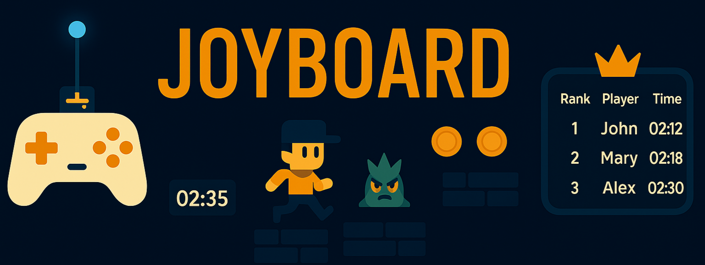
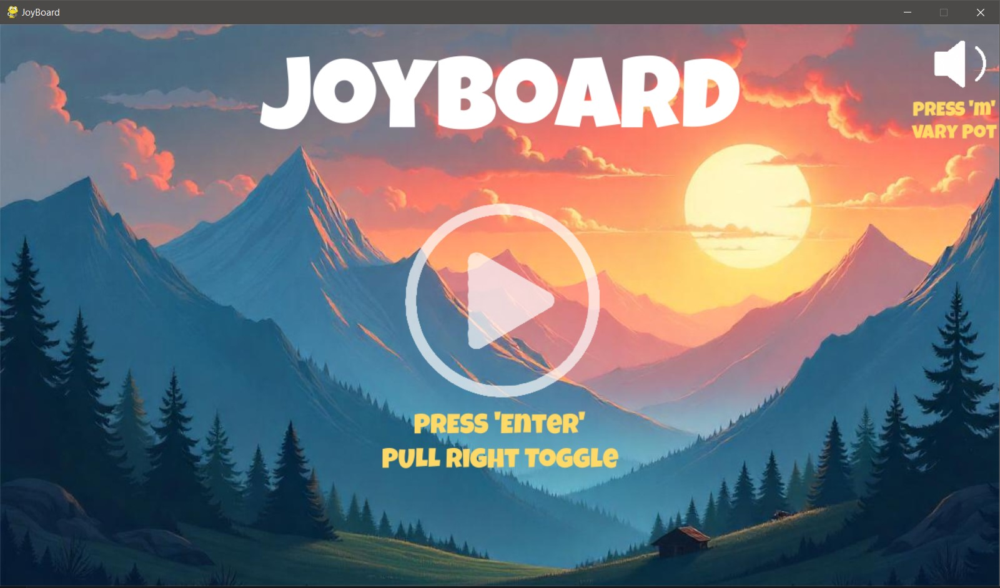
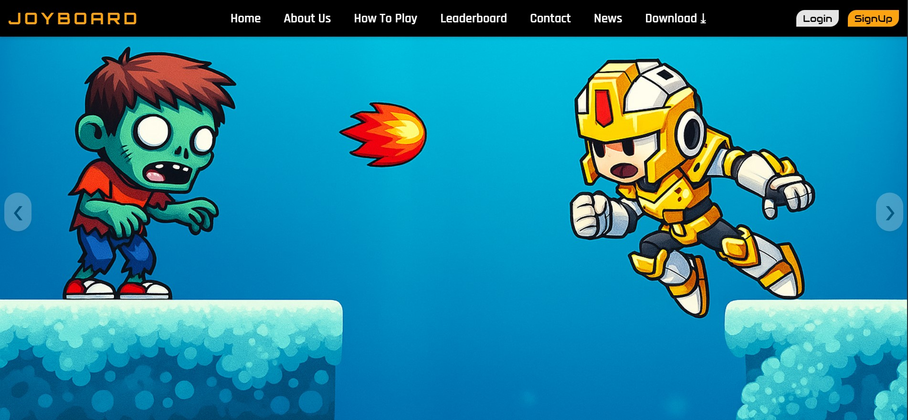
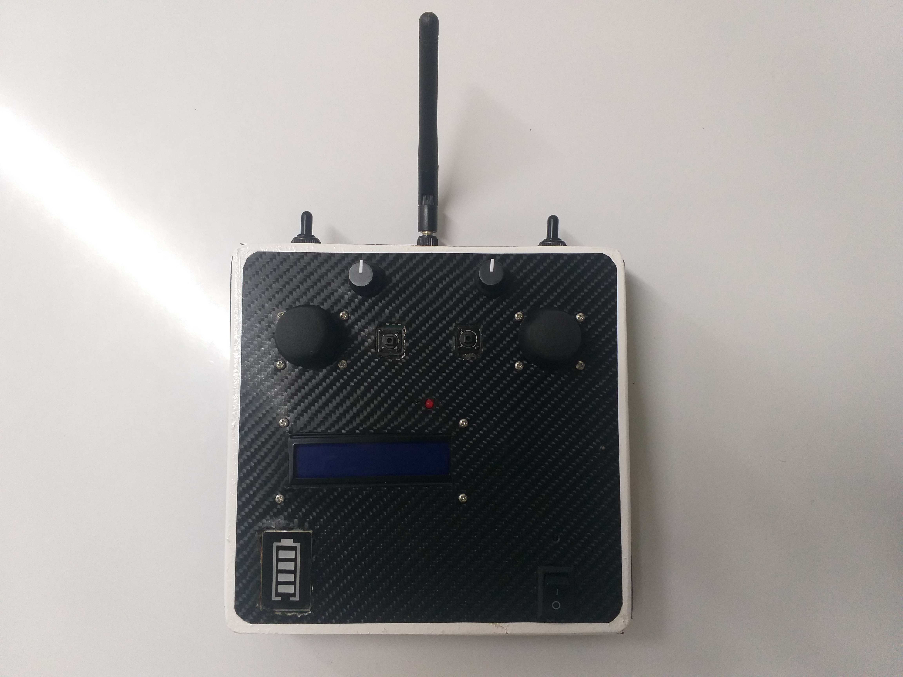

<p align="center">

  <!-- Banner Image -->
  

  <!-- Title -->
  <br>
  <br>
  <strong style="font-size:3.5rem;">JOYBOARD</strong>
  <br>

  <!-- Tagline -->
  <div align="center" style="font-size:1.5rem; color:#666; max-width:600px; margin:auto;">
    Where <strong>Gaming</strong> Meets <strong>Web</strong> & <strong>IoT</strong> — Play, Compete, and Connect.
  </div>
</p>

<br>

[](#)
[](https://github.com/siddhbotadara/JOYBOARD/stargazers)
[](https://joyboard.onrender.com)
[](https://joyboard.onrender.com)

[](#)
[](mailto:siddhbotadara@gmail.com)

---

## 📝 Overview

**JOYBOARD** is an integrated gaming ecosystem combining a fast-paced 2D platformer, a real-time web dashboard, and a custom Arduino wireless controller. Players tackle handcrafted levels with smart challenges while competing through live leaderboards and detailed gameplay analytics. With seamless hardware-software integration, JOYBOARD delivers a unique, immersive, and competitive gaming experience.

---

## 🗂️ Project Structure

The repository is organized into three main components:

- **[joyboard_game/](joyboard_game/README.md)**  
  Python Pygame platformer game featuring multi-level gameplay and custom physics.

  

- **[joyboard_web/](joyboard_web/README.md)**  
  Django-powered web application for user management, game analytics, and leaderboards.

  

- **[joyboard_controller/](joyboard_controller/README.md)**  
  Arduino-based wireless controller using NRF24L01 modules to interact with the game.

  

Each component has its own README file detailing installation, usage, and development instructions.

---

## ✨ Features

- Multi-level 2D platformer game with keyboard and wireless controller support  
- Full stack web application for player stats, match history, performance analytics and more  
- Wireless Arduino controller for immersive gameplay experience  
- Modular design enabling independent development and deployment  

For detailed features, please check the README files for each component.

---

## 🚀 Getting Started

### Clone the Repository
Open your terminal and run the following commands to clone the repository and navigate to the web component directory:
```bash
git clone https://github.com/siddhbotadara/JOYBOARD.git
cd joyboard_web
```
<br>

### Installation & Setup Overview
- **[joyboard_web](joyboard_web/)**
This component requires server setup and dependency installation. Please follow the detailed instructions in the [joyboard_web/README.md](joyboard_web/README.md) for environment setup, dependency management, and running the web application.

- **[joyboard_game](joyboard_game/)**
The game is a standalone executable licensed under [CC BY-NC-ND 4.0](https://creativecommons.org/licenses/by-nc-nd/4.0/), requiring no installation. It can be downloaded from the official [Joyboard website](https://joyboard.onrender.com/). Simply run the executable to start playing.

- **[joyboard_controller](joyboard_controller/)**
This is an Arduino-based hardware controller utilizing NRF24L01 modules. It does not require traditional software installation but needs to be programmed and set up via the Arduino IDE. Please refer to the [joyboard_controller/README.md](joyboard_controller/README.md) for detailed instructions.

Feel free to explore each component’s README for step-by-step setup and usage instructions.

---

## 🎥 Demo

My link to demo

---

## 🛣️ Roadmap

- Integrate AI/ML features for enhanced gameplay and personalized user experience  
- Expand hardware integrations with additional IoT devices and controllers  
- Develop multiplayer and social features for competitive play  
- Improve web dashboard with advanced analytics and player insights  
- Optimize game performance and add new levels/content  
- Implement cross-platform support for wider accessibility  
- Enhance security and anti-cheat mechanisms  

---

## 📄 License

- **Website:** MIT License — permissive open-source license allowing reuse with attribution.  
  [View License](https://choosealicense.com/licenses/mit/)

- **Game:** Creative Commons Attribution-NonCommercial-NoDerivatives 4.0 International (CC BY-NC-ND 4.0) — allows sharing with attribution, but no commercial use or derivatives.  
  [View License](https://creativecommons.org/licenses/by-nc-nd/4.0/)

- **Controller:** MIT License — permissive open-source license for hardware and software components.  
  [View License](https://choosealicense.com/licenses/mit/)

---

## 💬 Support/Feedback

Contact at email teamjoyboard@gmail.com.

---

⭐️ If you find **JOYBOARD** useful and fun, please consider [starring this repo](https://github.com/siddhbotadara/JOYBOARD)! It helps us a lot!
>Note: Please refer to each component’s specific README.md file for detailed information and usage instructions.

---