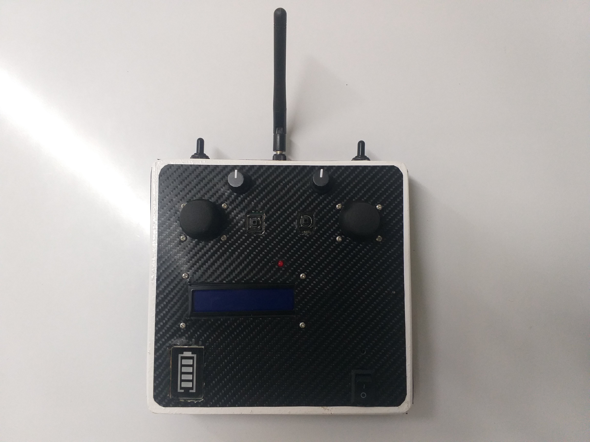
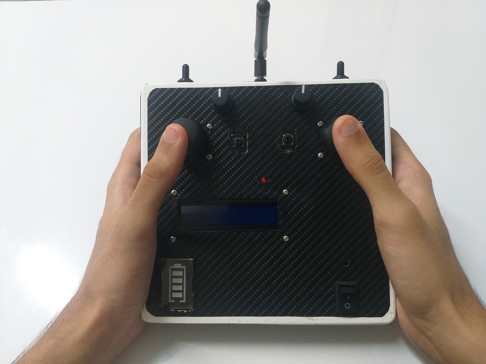

<p align="center">

  <!-- Banner Image -->
  

  <br>
  <br>
  <strong style="font-size:4.5rem;">joyboard_controller</strong>
  <br>

  <!-- Tagline -->
  <div align="center" style="font-size:1.5rem; color:#666; max-width:600px; margin:auto;">
    Go Wireless — Command the Game Your Way.
  </div>
</p>

<br>


-success.svg)


---

## 🎮 Overview

**JOYBOARD Controller** is a wireless Arduino transceiver with precise controls and ultra-low latency. Housed in a custom wooden chassis, it delivers long-range, reliable performance tailored for the JOYBOARD gaming ecosystem.

---

## 📸 Gallery

> A closer look at the JOYBOARD Controller in all its handcrafted glory.

---

### **Front View**
<p align="center">
  
</p>

---

### **Side Angle View**
<p align="center">
  
</p>

---

### **In Hand View**
<p align="center">
  
</p>

---

### **On View**
<p align="center">
  
</p>

---

### **Inside View**
<p align="center">
  
</p>

---


## ✨ Features

- 📡 **Wireless Freedom** — Uses nRF24L01+PA+LNA module for stable, long-range communication **up to 2 KM**.  

- ⚡ **Ultra-Low Latency** — Ensures responsive control with **under 10 ms** input delay.  
- 📊 **Multi-Channel Support** — Supports up to **12 independent channels**, enabling complex control schemes.  
- 🎮 **Precision Controls** — Equipped with dual joysticks, tactile buttons, toggle switches, and potentiometers for versatile input options.  
- 🪵 **Custom Build** — Handcrafted **wooden chassis** combines durability with an eco-friendly, premium tactile finish.  
- 💻 **Advanced Feedback** — Features a dedicated LCD display providing real-time output and system info, plus a battery level indicator for convenient monitoring.  
- 🔔 **Audible Alerts** — Integrated buzzer for alarms, notifications, and status alerts.  
- 🔋 **Long Battery Life** — Powered by two 18650 Li-ion batteries, delivering up to **15+ hours** of continuous operation.  
- 🔧 **Modular Design** — Easily replace or upgrade individual components (joysticks, buttons, antenna) without rebuilding the entire controller.  
- 💰 **Cost-Effective** — Offers high-end features and build quality at a price point significantly below market alternatives.  
- 🛠 **Fully Open Source** — Hardware and firmware are fully open for customization, modification, and community-driven improvements.

---

##  🛠 Build Instructions

### 📋 Required Components

| Component             | Quantity | Description                        |
|-----------------------|----------|----------------------------------|
| Arduino Nano/Uno      | 2        | Microcontroller boards            |
| nRF24L01+PA+LNA Module| 2        | Wireless transceiver modules      |
| Joystick Module       | 2        | Dual-axis analog joysticks        |
| Tactile Push Buttons  | 2        | Momentary push buttons            |
| Toggle Switches       | 2        | On-Off-On toggle switches         |
| Potentiometer         | 2        | Variable resistors for analog input |
| 18650 Li-ion Battery  | 2        | Rechargeable batteries            |
| Battery Holder        | 1        | Holder for 2x 18650 batteries     |
| Custom Wooden Chassis | 1        | Handcrafted enclosure             |
| Buzzer                | 1        | Audible alert device              |
| LCD Display + I2C Module | 1     | Dedicated display for feedback    |
| Miscellaneous         | —        | Wires, solder, connectors         |

<br>

> *Note: Quantities for toggle switches and other components may vary depending on your customization.*

---

### 🔌 Wiring Diagram

A comprehensive wiring schematic is provided below to guide the assembly of all components. It details connections between the Arduino, wireless module, input devices, power supply, LCD display, and buzzer.

- **Diagram style:** Schematic for clarity and ease of understanding.  
- **Location:** Find the full wiring diagram below or view it [here](../assets/Readme_Img/Schematic.png).  


<br>

> Ensure correct pin mapping according to the Arduino sketch configuration for seamless functionality.

---

### 📡 Setting Up the Receiver

Use a **second Arduino Nano or Uno** as the receiver. Only the **NRF24L01 module** is needed. Connect the pins as shown below:

| **NRF24L01 Pin** | **Arduino Pin** |
|-----------------|----------------|
| CE              | D9             |
| CSN             | D10            |
| MOSI            | D11            |
| MISO            | D12            |
| SCK             | D13            |

> ⚡ **Note:** No extra components are required on the receiver side.

---

<p align="center">
  
  <br>
  <strong>Figure:</strong> Wiring diagram showing the connection between the Arduino Uno and the NRF24L01 for <strong>reciever</strong>.
</p>

---

## 💻 Installation

Install the official Arduino IDE from the [Arduino website](https://www.arduino.cc/en/software).

The following libraries are **required**:

```cpp
#include <SPI.h>
#include <nRF24L01.h>
#include <RF24.h>
```

### To install them, follow these steps:

1. Open Arduino IDE.

2. Go to Sketch > Include Library > Manage Libraries...

3. Search for RF24 by TMRh20.

4. Click Install on the RF24 library.

>Note: SPI.h is built-in and does not require separate installation.

<br>

### ⚙️ Uploading Code and Configuration

1. **Open** the Arduino IDE.  
2. **Open** the transmitter and receiver `.ino` files located in the same folder.  
3. **Select** the correct board (**Uno** or **Nano**), the appropriate **COM port**, and set the **baud rate to 9600**.  
4. **Upload** the **transmitter** code to your controller board.  
5. **Upload** the **receiver** code to your receiver board.  
6. **Open** the **Serial Monitor** in the Arduino IDE (set to **9600 baud**) and **confirm** that data is being received correctly.  
7. Once confirmed, **close** the Arduino IDE completely.
8. **Open** the `arduino_setup.txt` file included in the game’s ZIP archive and update it with the correct COM port and baud rate settings.

9. **Close** the file and launch the game.

---

## 🚀 Roadmap

- Develop modular hardware components for easy upgrades and repairs  
 
- Introduce encrypted wireless communication for enhanced security  
- Support multi-controller pairing for multiplayer gameplay  
- Create companion software tools for calibration and diagnostics  
- Expand compatibility with third-party games and applications  
- Publish detailed tutorials and establish a community support forum

---

## ❓ FAQ - Troubleshooting & Support

### 🔧 Controller Connection Issues

**Q1: My controller is not responding. What should I check?**  
- Verify the correct COM port is selected (e.g., COM3, COM9).  
- Ensure the baud rate in your Arduino code matches the Arduino IDE and game settings.  
- Confirm no other applications are using the same COM port.  
- Restart the game *after* plugging in the Arduino controller.  

**Q2: Communication between the controller and receiver randomly stops. What can I do?**  
- Use high-quality jumper wires to ensure stable connections.  
- Use a shorter USB cable to minimize signal interference.  
- Avoid using USB hubs, which may cause communication issues.  
- Restart both the Arduino device and the game to reset connections.  

### 🛠 Software & Firmware

**Q3: How do I know if the code uploaded correctly?**  
- Open the Serial Monitor in Arduino IDE at 9600 baud; you should see data being received.  
- If not, recheck wiring and COM port settings.  

**Q4: Can I update the firmware without disconnecting the controller?**  
- Currently, firmware updates require uploading via the Arduino IDE with the device connected via USB. OTA updates are planned for future releases.  

### 🔋 Battery & Power

**Q5: How long does the battery last?**  
- Using two 18650 Li-ion batteries, the controller can operate continuously for approximately 15+ hours depending on usage and power settings.  

**Q6: How do I monitor battery level?**  
- The controller includes a dedicated battery level indicator displayed on the LCD for real-time monitoring.  

### 📞 Support & Contact

**Q7: Where can I get help if I encounter issues?**  
- Contact us via the project’s contact form or email at **teamjoyboard@gmail.com**.  
- Visit the community forums (link to be added) for support and discussions.  

<br>

>*If your question isn’t listed here, feel free to reach out directly for assistance!*

---

## 📄 License

This project is licensed under the [MIT License](LICENSE).  
Feel free to use, modify, and distribute the code and hardware designs with proper attribution.


---
 **Note:** The JOYBOARD ZIP file includes all Arduino source files and a detailed setup guide to ensure a smooth assembly and configuration process.

---