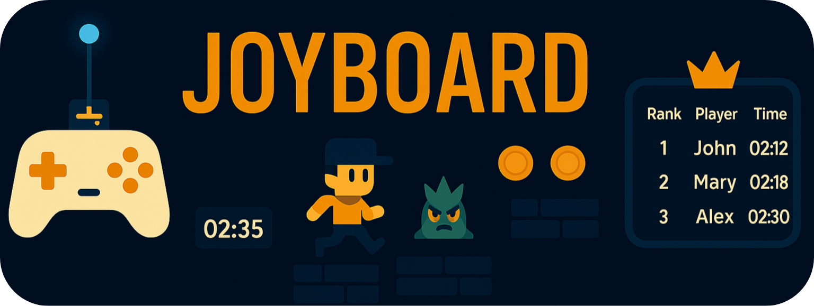

  <!-- Banner Image -->
  

   
   
  <strong style="font-size:4.5rem;">joyboard_game</strong>
   

  <!-- Tagline -->
  

    Every Match, Every Move — Feel the Rush.
  

 

<!-- Language & Framework -->

<!-- Version & Status -->

<!-- Platform & Download -->

<!-- License -->

---

## Overview

JOYBOARD is a fast-paced 2D platformer built with Python and Pygame, protected by server. Play seamlessly using keyboard or the custom Arduino wireless controller.
Face challenging levels with smart enemies, collectibles, and timed obstacles that test your skills.
Compete on a real-time leaderboard tracking your best times — every run is a fight for the top spot.
More than a game, JOYBOARD is a competitive arena where you challenge friends and prove your mastery.

---

## 🛠️ Features

- Multiple handcrafted levels with escalating difficulty

- Custom physics engine delivering smooth, responsive movement  
- Health and immunity system with intuitive, game-style UI  
- Dynamic hazards (e.g., lava) and challenging enemies  
- Unique collectible coins to enhance gameplay  
- Balanced mechanics with weapon and jump cooldowns  
- Native support for Arduino-based wireless controller (NRF24L01) with near-zero latency  
- Polished user interface including pause menu, volume control, and login screen  
- Real-time online leaderboard and player profile tracking  
- Seamless level transitions for uninterrupted gameplay flow  
- Immersive sound effects and background music  
- Minimalist design optimized for performance and low resource usage  
- Compact game size (~50MB) for quick downloads and smooth installs  
- Server-guarded challenges ensuring unbeatable security  
- Planned support for modular upgrades and customizable level selection  

---

## 💾 Installation Guide

To get started with JOYBOARD, follow the steps below:

### Step 1: Download the Game
1. Visit the official website and click the **Download** button in the navbar.  
2. You will be redirected to the **Download** page. Make sure you have an account and are logged in (account required to download).  
3. Click **Download ZIP for Windows**.  
4. Read the important message popup, then click **Agree and Download**.  
5. The ZIP file will start downloading.

### Step 2: Setup and Launch
1. Extract the downloaded ZIP file to a preferred location on your PC.  
2. Open the extracted folder: `Joyboard_Pack\`  
3. Launch `Joyboard_Game.exe` by double-clicking it.  
4. Log in with your credentials.  
   - Don’t have an account? Sign up here:  
     ▶ [https://joyboard.onrender.com/](https://joyboard.onrender.com/)  

### Step 3: Optional - Create Shortcut for Easy Access
- For convenience, **right-click** on `Joyboard_Game.exe` and select **Create shortcut**.  
- Place this shortcut anywhere you like — desktop, start menu, or other folders.  
- You can even drag the shortcut to your taskbar for quick launching.  

> **Important:** Do **NOT** move the actual `Joyboard_Game.exe` file from its folder, as it relies on accompanying files and folders. Using a shortcut is the safest method.

---

### 💻 System Requirements

| Component     | Specification                        |
|---------------|------------------------------------|
| Operating System | Windows 10 or 11 (32/64-bit)      |
| CPU           | Dual-core 2 GHz or higher           |
| RAM           | Minimum 2 GB                       |
| GPU           | Integrated graphics sufficient      |
| Disk Space    | Approximately 50 MB free            |
| Python        | Not required (Python runtime included in .exe) |
| USB           | Required **only** if using Arduino wireless controller |

---

### Troubleshooting

If launching `Joyboard_Game.exe` opens a **blank terminal window** (black screen with no text), please **wait patiently** — the server is likely still initializing.

---

## 🕹️ Controls

---

### Keyboard Mode
- **Move Left/Right:** Arrow keys (`←` / `→`)  
- **Jump:** `Space` or `↑ Up Arrow`  
- **Shoot:** `F`  
- **Pause/Menu:** `Esc`  
- **Restart:** `R`  
- **Homepage:** `H`  
- **Mute/Unmute:** `M`  
- **Start Game:** `Enter` or `Space`  

---

### Wireless Controller Mode  
*(Arduino + NRF24L01)*  
- **Move:** Right Joystick  
- **Jump & Shoot:** Left Joystick  
- **Pause/Menu:** Left Button  
- **Restart:** Toggle Down  
- **Homepage:** Right Button  
- **Start Game:** Toggle Up  
- **Volume Control:** Potentiometer  

 

💡 **Tip:** Press `Esc` to access **Restart** and **Homepage** from the main menu in both modes.

For full instructions and detailed gameplay guide, visit:  
▶ [https://joyboard.onrender.com/rules/](https://joyboard.onrender.com/rules/)

---

## 🎮 Gameplay

Dive into the fast-paced world of JOYBOARD with intuitive mechanics and engaging challenges designed to test your skills and reflexes.

### Core Mechanics
- Navigate through multiple handcrafted levels featuring increasing difficulty.
- Dodge hazards like lava pits and defeat various intelligent enemies.
- Collect custom coins scattered throughout the stages.
- Manage health and immunity while balancing weapon and jump cooldowns.
- Utilize either keyboard controls or the Arduino wireless controller for a seamless experience.

### Game Modes
- **Single Player:** Complete levels in fastest time, striving for the best scores.

### Objectives
- Conquer all levels by reaching the goal with lowest time taken.
- Maximize score by collecting coins and defeating enemies efficiently.
- Compete on the online leaderboard to earn bragging rights.

### Tips & Tricks
- Use the pause menu to adjust volume and access game settings.
- Master the timing of jumps and attacks to overcome tougher enemies.
- Keep an eye on your health and cooldown indicators to survive longer.

For detailed guides, tips, and updates, visit the official gameplay page:  
▶ [https://joyboard.onrender.com/rules/](https://joyboard.onrender.com/rules/)

---
## 🚀 Roadmap

- Add new challenging levels with unique mechanics and hazards

- Introduce diverse enemy types with advanced AI behaviors  
- Implement customizable character skins and power-ups  
- Enhance multiplayer modes with real-time player interaction  
- Develop cross-platform compatibility for macOS and Linux  
- Integrate cloud save and profile synchronization  
- Improve audio with dynamic sound effects and adaptive music  
- Expand online leaderboard features with friend challenges and seasonal events  
- Optimize game performance and reduce executable size  
- Provide in-game tutorials and accessible gameplay guides  
- Launch community events and competitions to engage players  

>We’re committed to evolving JOYBOARD into a richer, more immersive experience with every update!

---
## ❓ FAQ - Frequently Asked Questions

### 🎮 Gameplay & Controls

**Q1: Can I use both keyboard and wireless controller simultaneously?**  
A: No, the game supports one input mode at a time. You can switch between keyboard and the Arduino-based wireless controller before starting the game.

**Q2: How do I pause the game?**  
A: Press the `Esc` key on the keyboard or the Left Button on the wireless controller to pause and access the menu.

---

### 🔧 Installation & Setup

**Q3: Do I need Python installed to run the game?**  
A: No, the game is packaged as a standalone Windows executable (~50MB) and does not require Python installation.

**Q4: What should I do if the game opens a blank terminal window?**  
A: Please wait a few moments as the server might still be initializing. If the issue persists, please visit the website once, as the server may be in a sleep state.

---

### 🔗 Account & Leaderboard

**Q5: How do I create an account?**  
A: Visit [https://joyboard.onrender.com/](https://joyboard.onrender.com/) and sign up using the sign up page.

**Q6: Is the leaderboard updated in real-time?**  
A: Yes, your best level completion times are updated live as you progress.

---

### 🎮 Gameplay Mechanics

**Q7: How do collectibles affect the game?**  
A: You must collect the required items to advance to the next level.

**Q8: What happens when my health runs out?**  
A: Your journey resets — back to Level 1!

**Q9: Are there any cheat codes or debug modes?**  
A: No, JOYBOARD emphasizes fair competition and skill-based progression. Cheats or debug modes are not supported.

---

### 🎯 Challenges & Levels

**Q10: How many levels does the game have?**  
A: The game currently features 5 handcrafted levels with escalating difficulty, with more planned for future updates.

**Q11: Can I replay levels to improve my score?**  
A: No, you cannot replay any level to improve your completion time and leaderboard ranking.

---

### 🎵 Audio & Visuals

**Q12: Can I adjust the game volume or mute the sound?**  
A: Yes, use the volume controls in the pause menu or the potentiometer on the wireless controller.

**Q13: Are there accessibility options for colorblind or hearing-impaired players?**  
A: Currently, there are no dedicated accessibility settings, but this is planned for future updates.

---

### ⚙️ Technical

**Q14: What should I do if the game crashes or freezes?**  
A: Restart the game and ensure your system meets the minimum requirements. If issues persist, contact support with error details.

**Q15: Can I play the game on platforms other than Windows?**  
A: At present, JOYBOARD is officially supported only on Windows 10/11. Cross-platform support is planned for future releases.

---

### 🔄 Updates & Community

**Q16: How do I get notified about game updates?**  
A: Follow our official website and social media channels. We also notify registered users via email.

**Q17: Is there a way to suggest features or report bugs?**  
A: Yes! Please use the contact form on our website or email us directly at **teamjoyboard@gmail.com**.

---

### 📞 Support & Contact

**Q18: Where can I get help if I encounter issues?**  
A: Contact us via the project’s email: **teamjoyboard@gmail.com** or visit our contact page on the website.

>*If your question is not answered here, feel free to reach out to us for assistance!*

---

## 📢 Note for Recruiters and Interested Viewers

This repository contains a **subset of the Python source files** used to create JOYBOARD GAME.  
To protect the integrity and security of the game, **not all code files are publicly available** here.

If you are a **recruiter** or a **genuinely interested collaborator**,  
please feel free to reach out via email at **teamjoyboard@gmail.com** for access to the complete source code.  

Thank you for your understanding and respect for my project's security.

---

## 🧑‍💻 Credits

- **Game Developer:** Joyboard Team  
- **Game Engine:** Pygame  
- **Controller System:** Arduino + NRF24L01  
- **UI/UX Design:** Custom Minimalist  
- **Player & Enemy Art:** gameart2d (Free Assets)  
- **Game Font:** Luckiest Guy - Regular  
- **Coins & Tiles:** Generated with AI  
- **Music:** Pixabay, OpenGameArt, AI-generated  
- **Background Images:** AI-generated  
- **Logo:** AI-generated
---
## 📜 License

This game is licensed under the [Creative Commons Attribution-NonCommercial-NoDerivatives 4.0 International License](https://creativecommons.org/licenses/by-nc-nd/4.0/).  

You are free to share the game with proper credit to the JoyBoard Team, but you may **not** use it for commercial purposes or create derivative works.

---

🎮 Enjoy the game and happy playing!

---